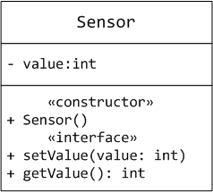
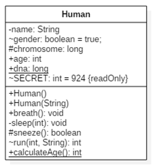

# Лабораторна робота 3 : Інкапсуляція. Знайомство з мовою моделювання UML


> Змоделюйте класи `Box`, `Item`, `Cart`, `Order`, `IntStack` для діаграми класів UML.

> Створіть новий проєкт в StarUml, змоделюйте класи, збережіть проєкт та додайте mdj-файл до програмного проєкту.

## Завдання 1. Клас Box

Вам задано геометричну фігуру `Box` з параметрами довжина, ширина та висота. Змоделюйте клас `Box`, об'єкт якого можна створити за цими ж трьома параметрами. Відкрийте для зовнішнього світу лише методи для підрахунку площі його поверхні, площі бічної поверхні та об'єму (формули: http://www.mathwords.com/r/rectangular_parallelepiped.htm)

Сторона коробки не повинна бути нулем або від'ємним числом. Додайте перевірку даних для кожного параметра, що передається конструктору. Створіть закритий (private) сеттер, який виконує перевірку даних всередині класу.

В методі `main()` створіть об'єкт коробки з параметрами та виведіть в консоль значення площі його поверхні, площі бічної поверхні та об'єму.

## Завдання 2. Класи Item, Cart, Order

В програмному проєкті присутні класи товару (`Item`), кошика інтернет-магазину (`Cart`) та замовлення (`Order`), а також метод `main()`.

Треба змінити зміст класів для того, щоб був дотриманий принцип інкапсуляції, а також використання ключового слова `this`. Ви можете змінювати назви полів, методів, вхідних аргументів, переносити код з одного класу до іншого і так далі. Також, за потреби, можна додати методи.


## Завдання 3. Клас IntStack

Необхідно створити клас `IntStack`, який реалізує функціонал стека цілих чисел за допомогою статичного масиву.

Під час реалізації стека враховуйте таке:

- під час реалізації класу вам необхідно вказати область видимості для полів і методів. Подумайте про те, які методи необхідно віднести до "інтерфейсу", а які до реалізації;
- розмір стека для зовнішнього користувача не має значення і теоретично необмежений;
- зовнішній користувач не повинен знати й здогадуватися, що стек "усередині" реалізовано за допомогою звичайного статичного масиву;
- ви маєте написати "реалізацію" класу таким чином, щоб можна було моделювати динамічну поведінку стека за допомогою звичайного статичного масиву;
- продумайте, які аргументи мають приймати методи і які значення повертати.

Для зовнішнього користувача класу, поведінка класу має такий вигляд:
- користувач може створити новий стек із конструктором без параметрів;
- користувачеві доступна команда `pop()` для вилучення елемента зі стека;
- метод `pop()` повертає витягнутий елемент. У разі спроби витягти з порожнього стека, метод повертає `0` або викидає виняток (реалізуйте викид винятку, якщо ви знаєте, як це робити та що таке виняток);
- користувачеві доступна команда `push()`, яка додає елемент до стеку;
- користувачеві доступна команда `peek()` для перегляду елемента на вершині стеку без його винятку;
- користувач може отримати значення кількості елементів у стеку за допомогою методу `size()`;
- користувач може перевірити, чи порожній стек за допомогою методу `isEmpty()`;
користувач може очистити стек повністю за допомогою методу `clear()`.

## Мова моделювання UML

UML - уніфікована мова моделювання (Unified Modeling Language) - це система позначень, яку можна застосовувати для об'єктно-орієнтованого аналізу та проектування. Її можна використовувати для візуалізації, специфікації, конструювання та документування програмних систем.

> Посилання на додатки для побудови діаграм UML - http://staruml.io/download

Діаграма - це графічне представлення набору елементів, найчастіше зображеного у вигляді зв'язного графа вершин (сутностей) і шляхів (зв'язків). Мова UML включає 13 видів діаграм, серед яких на першому місці в списку - діаграма класів. Діаграма класів описує типи об'єктів системи та різного роду статичні відносини, які існують між ними. На діаграмах класів відображаються також властивості класів, операції класів та обмеження, які накладаються на зв'язки між об'єктами.

> Якщо хто-небудь підійде до вас у темному провулку і запитає: "Хочете подивитися на діаграму UML?", знайте - найімовірніше, йдеться про діаграму класу. Більшість діаграм UML, які я зустрічав, були діаграмами класів. (с) Мартін Фаулер

Графічно клас зображується у вигляді прямокутника, розділеного на три блоки горизонтальними лініями:

- ім'я класу;
- атрибути (властивості) класу;
- операції (методи) класу.

Для атрибутів і операцій може бути вказано один із трьох типів видимості:

```
- private;
~ без модификатора (default);
# protected;
+ public.
```

Видимість для полів і методів вказується у вигляді лівого символу в рядку з іменем відповідного елемента.

Кожен клас повинен мати ім'я, що відрізняє його від інших класів. **Ім'я** - це текстовий рядок. Ім'я класу може складатися з будь-якого числа літер, цифр і розділових знаків (за винятком двокрапки і крапки) і може записуватися в кілька рядків.

**Атрибут (властивість)** - це іменована властивість класу, що описує діапазон значень, які може приймати екземпляр атрибута. Клас може мати будь-яке число атрибутів або не мати жодного. В останньому випадку блок атрибутів залишають порожнім. Можна уточнити специфікацію атрибута, вказавши його тип, кратність (якщо атрибут являє собою масив деяких значень) і початкове значення за замовчуванням. Статичні атрибути класу позначаються підкресленням.

**Операція (метод)** - це реалізація методу класу. Клас може мати будь-яку кількість операцій або не мати жодної. Часто виклик операції об'єкта змінює його атрибути. Графічно операції представлені в нижньому блоці опису класу. Допускається зазначення тільки імен операцій. Ім'я операції, як і ім'я класу, має являти собою текст. Можна специфікувати операцію, встановлюючи її сигнатуру, що включає ім'я, тип і значення за замовчуванням усіх параметрів, а стосовно функцій - тип значення, що повертається.

Абстрактні методи класу позначаються курсивним шрифтом. Статичні методи класу позначаються підкресленням.

Зображуючи клас, не обов'язково показувати відразу всі його атрибути та операції. Для конкретного подання, як правило, істотна тільки частина атрибутів і операцій класу. З огляду на ці причини допускається спрощене представлення класу, тобто для графічного представлення обираються тільки деякі з його атрибутів. Якщо крім зазначених існують інші атрибути та операції, ви даєте це зрозуміти, завершуючи кожен список три крапки. Щоб легше сприймати довгі списки атрибутів і операцій, бажано додати префікс (ім'я стереотипу) до кожної категорії в них. У цьому разі стереотип - це слово, укладене в кутові лапки, яке вказує на те, що за ним іде.



Розглянемо приклад класу - його графічне представлення і код мовою Java.



```java
public class Human {

    private String name;        // private це "-"
    Boolean gender = true;      // default це "~"
    protected long chromosome;  // protected це "#"
    public int age;             // public це "+"

    // Статичні атрибути підкреслюються
    public static long dna;
    
    // Константи можна отобазити як readOnly
    final int SECRET = 924;

    /* Як правило, конструктори 
       зображуються як звичайні методи 
    */
    public Human() {}
    public Human (String name) {this.name = name;}

    /* Методи відображаються як
     * [-~#+]ім'я(тип_аргументів): тип, що повертається
     * Наприклад: public String foo (int a, double b)
     * буде +foo(int, double): String */
    public void breath() {}
    private void sleep(int hours) {}
    protected boolean sneeze() { return true; }
    int run (int speed, String direction) { return 0; }
    public static int calculateAge() { return 0; }
}
```